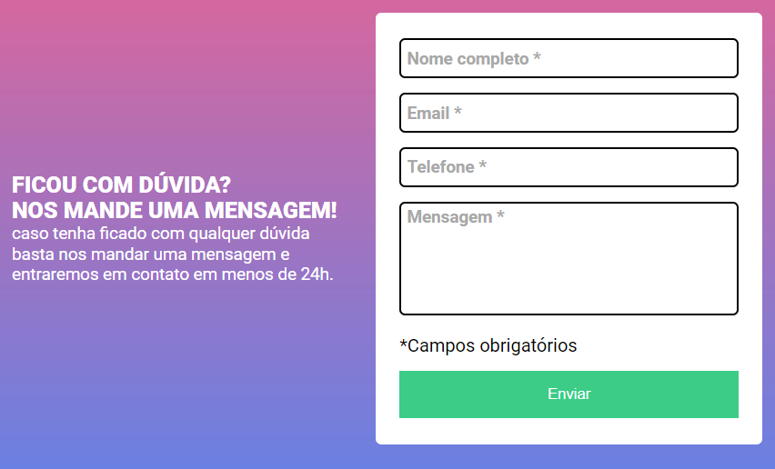

# Arquivo README informando dados do projeto

Projeto realizado com a proposta de aprofundar os conhecimentos de desenvolvimento web, com funções de validação dos campos de texto somente com JavaScript. 

## Imagens do projeto

## Tecnologias Utilizadas

- HTML
- CSS
- JS
